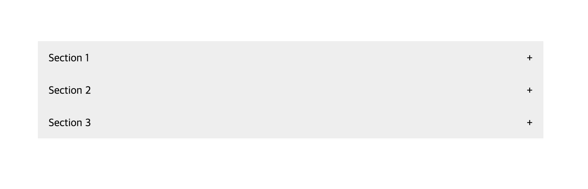

# Collapsible (Accordion)

A collapsible content component that allows you to hide and show detailed content with a click.

 

## Functionality

- **Inactive state**:

  - The section title has a light grey background color
  - A plus sign (+) is displayed, indicating the collapsible content is closed

- **Hover state**:

  - The section title background changes to dark grey when hovered

- **Active state**:

  - The section title background changes to dark grey when active (clicked)
  - The plus sign changes to a minus sign (-), indicating the collapsible content is open

 

## How to Create a Collapsible Accordion

1. Create HTML elements for the section titles and their respective content.
2. Align section titles and symbols at opposite edges of the box with `display: flex` and `justify-content: space-between`
3. Hide the content element by default with `max-height: 0` and `overflow: hidden`
4. Add click interactivity to section titles

   - Attach click event listeners to all section titles
   - Toggle an active class on the title element when clicked

5. Update the section title background and symbol when the title is clicked

   - Define CSS rules for the active class to change the background color of the title and switch the symbol

6. Make the content visible when its title is clicked

   - Adjust the `max-height` value of the content element with event listeners
