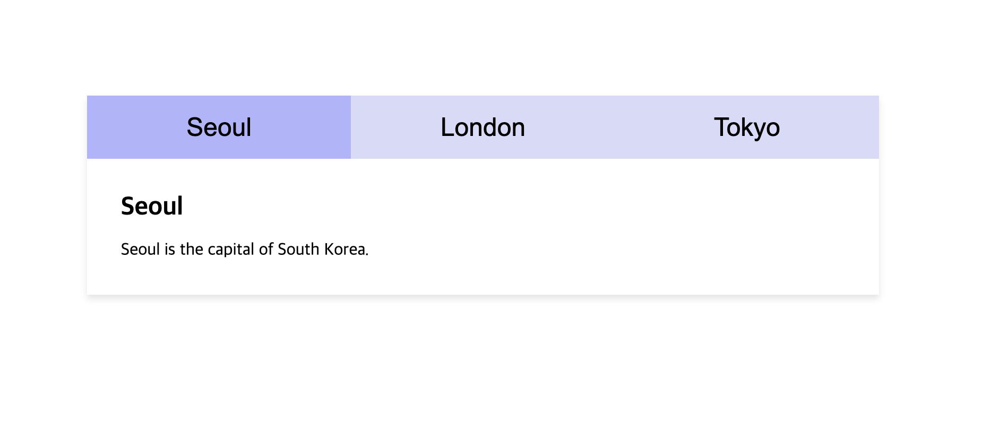

# Tabs

Tabs that display different content when clicked.

 

## Functionality

- **Inactive state**:

  - Tab buttons hav a light purple background color
  - The first tab's content is displayed by default

- **Hover state**:

  - Tab button background changes to dark purple when hovered

- **Active state**:

  - Tab button background changes to darker purple when active (clicked)
  - The corresponding tab's content is displayed
  - When a new tab is clicked, the previously active tab closes and the new tab's content opens

 

## How to Create Tabs

1. Create HTML elements for the tab button and their respective content.
2. Hide all tab contents with `display: none`
3. Add click interactivity to tab buttons

   - Attach event listeners to all tab buttons
   - On button click:
     1. Remove active classes from the previously selected tab to close it
     2. Add active classes to newly selected tab and its content

4. Define CSS rules for the active state

   - Specify background color changes for the active tab buttons
   - Display the corresponding tab content

5. Display the first tab content in default state by simulating a click when the page loads
