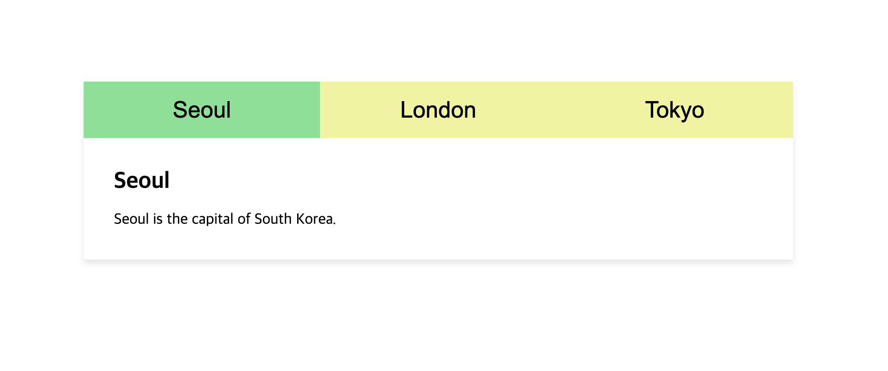

# Frontend Components

Micro frontend components built with HTML, CSS, and JavaScript. This is an ongoing project and total 4 components are completed so far.

## Menus

### 1. Icon Bar

### 2. Collapsible (Accordion)

### 3. Togglable Tabs

### 4. Hoverable Tabs

